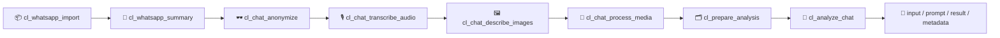
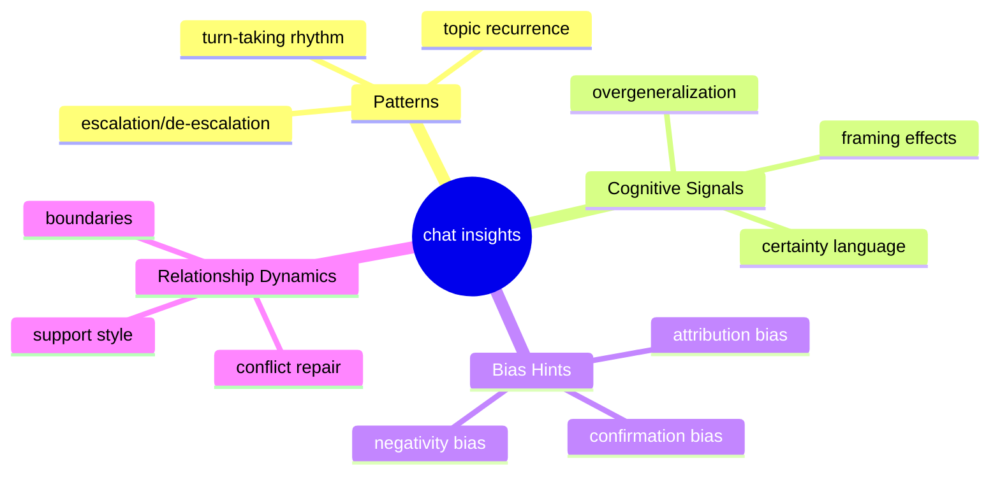

# chatlens 🧠📱🔎

`chatlens` is an R package for turning WhatsApp exports into structured data, media-enriched transcripts, and behavior-pattern insights.

Think: **social signal mining for humans** (with clean R workflows and reproducible outputs). ✨

## Status 🚧

This package is **super beta (almost alpha)**.  
Expect bugs, rough edges, and breaking changes while the API stabilizes.

## Why this is fun for R people 🎉

- Data-first API: returns `data.frame` / `chatlens_chat` objects you can inspect and transform.
- Real pipeline feel: import -> anonymize -> enrich -> prepare -> analyze.
- Works great with prompt-driven analysis for:
  - communication patterns
  - cognitive style hints
  - possible bias signals in language
  - relationship dynamics across time periods

## Core workflow 🧭


```mermaid
flowchart LR
    A[📦 cl_whatsapp_import] --> B[🧾 cl_whatsapp_summary]
    B --> C[🕶️ cl_chat_anonymize]
    C --> D[🎙️ cl_chat_transcribe_audio]
    D --> E[🖼️ cl_chat_describe_images]
    E --> F[🧩 cl_chat_process_media]
    F --> G[🗂️ cl_prepare_analysis]
    G --> H[🧠 cl_analyze_chat]
    H --> I[💾 input / prompt / result / metadata]
```

## Install

`chatlens` depends on `genflow`, and right now you need to install it from GitHub first:

```r
install.packages("remotes")
remotes::install_github("hugorteixeira/genflow")
```

From local source:

```r
install.packages("devtools")
devtools::install_local(".")
```

## Quick start ⚡

```r
library(chatlens)

# 1) Import WhatsApp zip
chat <- cl_whatsapp_import(
  path = "WhatsApp Chat - Family.zip",
  tz = "America/Sao_Paulo",
  omit_sender_na = TRUE
)

# 2) Fast quality check
cl_whatsapp_summary(chat)

# 3) Optional anonymization
chat <- cl_chat_anonymize(chat, interactive = TRUE)

# 4) Media enrichment (audio + images)
chat <- cl_chat_transcribe_audio(chat, service = "replicate", model = "openai/whisper")
chat <- cl_chat_describe_images(
  chat,
  prompt = "Describe this image with focus on social context, emotions, and relevant objects."
)
chat <- cl_chat_process_media(chat)

# 5) Prepare compact LLM input
prepared <- cl_prepare_analysis(
  chat,
  period = "month",
  select = "2025-01:2025-03"
)

# 6) Prompted analysis
analysis <- cl_analyze_chat(
  prepared,
  prompt = "Map recurring communication patterns, possible cognitive biases, and shifts in emotional tone. Be concrete and cite examples.",
  service = "openai",
  model = "gpt-5.2",
  reasoning = "high"
)

analysis
```

## Analysis inputs

`cl_prepare_analysis()` saves the exact text sent to the LLM under the chat
analysis directory. By default it uses compact `"simple"` formatting, which
groups repeated dates and consecutive messages from the same sender. This is
also the transcript export step for analysis.

All cache-backed functions use `cache_dir = NULL` by default, which resolves to
`~/.chatlens`. Pass the same `cache_dir` to import, processing, and analysis if
you want to keep a chat in a different cache root.

```r
# Whole chat
prepared <- cl_prepare_analysis(chat)

# One month as one input
prepared <- cl_prepare_analysis(chat, period = "month", select = "2023-08")

# One input per day in the selected month
prepared <- cl_prepare_analysis(chat, period = "day", select = "2023-08")
```

The default analysis layout is:

```text
~/.chatlens/whatsapp/chats/<chat_key>/analysis/
  all/input.txt
  by_year/<YYYY>/input.txt
  by_month/<YYYY>/<MM>/input.txt
  by_week/<YYYY>/<WW>/input.txt
  by_day/<YYYY>/<MM>/<DD>/input.txt
```

Each prepared directory also stores `input.rds` when `save = TRUE`. After
`cl_analyze_chat()`, the same directory receives timestamped analysis artifacts:

```text
prompt_<timestamp>_<service>_<model>.txt
result_<timestamp>_<service>_<model>.txt
result_<timestamp>_<service>_<model>.rds
meta_<timestamp>_<service>_<model>.json
run_<timestamp>_<service>_<model>.json
```

## Prompt ideas for pattern, bias, and cognitive insights 🧠

```r
prompt <- paste(
  "You are analyzing chat communication patterns.",
  "Identify:",
  "1) recurring interaction loops (trigger -> response -> outcome),",
  "2) possible cognitive bias signals (confirmation bias, negativity bias, availability bias),",
  "3) disagreement and repair style,",
  "4) concrete examples with quoted snippets,",
  "5) practical suggestions to improve clarity and empathy.",
  "Do not diagnose medical or psychiatric conditions."
)

prepared <- cl_prepare_analysis(chat, period = "month")

insights <- cl_analyze_chat(
  prepared,
  prompt = prompt,
  service = "openai",
  model = "gpt-5.2",
  reasoning = "high"
)
```

## Insight map 🗺️


```mermaid
mindmap
  root((chat insights))
    Patterns
      turn-taking rhythm
      escalation/de-escalation
      topic recurrence
    Cognitive Signals
      certainty language
      overgeneralization
      framing effects
    Bias Hints
      confirmation bias
      negativity bias
      attribution bias
    Relationship Dynamics
      support style
      conflict repair
      boundaries
```

## Cache + artifacts 📁

By default, outputs are cached under `~/.chatlens`, including:

- extracted WhatsApp files
- audio transcripts
- image descriptions
- manifests and run logs
- analysis inputs, prompts, results, provider metadata, and run metadata
- chat RDS backups with mirrored `.txt` transcripts (`chat_original.*` keeps
  the raw import; `chat.*` is the latest `chatlens_chat` state)

This makes reruns faster and reproducible.

## Safety note ⚠️

`chatlens` is for communication analysis and reflection, not clinical diagnosis.
Use insights as hypotheses to test, not absolute truth.

## Philosophy

**Serious analysis, playful workflow.**  
If your chats are messy, your pipeline does not need to be.
