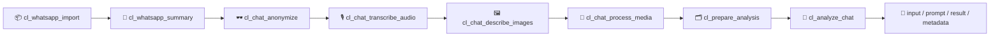
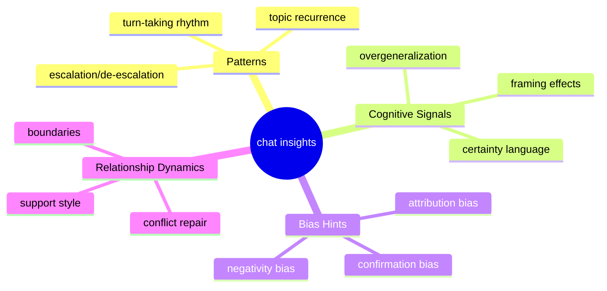

# chatlens 🧠📱🔎

`chatlens` is an R package for turning WhatsApp exports into structured data, media-enriched transcripts, and behavior-pattern insights.

Think: **social signal mining for humans** (with clean R workflows and reproducible outputs). ✨

## Status 🚧

This package is **super beta (almost alpha)**.  
Expect bugs, rough edges, and breaking changes while the API stabilizes.

## Why this is fun for R people 🎉

- Data-first API: returns `data.frame` / `chatlens_chat` objects you can inspect and transform.
- Real pipeline feel: import -> anonymize -> enrich -> prepare -> analyze.
- Works great with prompt-driven analysis for:
  - communication patterns
  - cognitive style hints
  - possible bias signals in language
  - relationship dynamics across time periods

## Core workflow 🧭


```mermaid
flowchart LR
    A[📦 cl_whatsapp_import] --> B[🧾 cl_whatsapp_summary]
    B --> C[🕶️ cl_chat_anonymize]
    C --> D[🎙️ cl_chat_transcribe_audio]
    D --> E[🖼️ cl_chat_describe_images]
    E --> F[🧩 cl_chat_process_media]
    F --> G[🗂️ cl_prepare_analysis]
    G --> H[🧠 cl_analyze_chat]
    H --> I[💾 input / prompt / result / metadata]
```

## Install

`chatlens` requires `genflow >= 0.0.5`. Install the current `genflow` release
before loading Chatlens:

```r
install.packages("remotes")
remotes::install_github("hugorteixeira/genflow", force = TRUE)
stopifnot(packageVersion("genflow") >= "0.0.5")
```

Restart the R session after installing or updating `genflow`; an already loaded
namespace keeps the old functions even when the package on disk is newer.
Before scanning or changing the image cache, Chatlens verifies that the live
`genflow` namespace supports the parallel image-batch contract and reports the
loaded and installed versions when a restart or reinstall is needed.

Image provider requests use independent PSOCK worker processes. They do not
fork the active RStudio process or inherit its initialized `curl`/`httr` state.

Then install `chatlens` from its local source directory:

```r
install.packages("devtools")
devtools::install_local(".")
```

## Quick start ⚡

```r
library(chatlens)

# 1) Import WhatsApp zip
chat <- cl_whatsapp_import(
  path = "WhatsApp Chat - Family.zip",
  tz = "America/Sao_Paulo",
  omit_sender_na = TRUE
)

# 2) Fast quality check
cl_whatsapp_summary(chat)

# 3) Optional anonymization
chat <- cl_chat_anonymize(chat, interactive = TRUE)

# 4) Media enrichment (audio + images)
chat <- cl_chat_transcribe_audio(chat, service = "replicate", model = "openai/whisper")
chat <- cl_chat_describe_images(
  chat,
  prompt = "Describe this image with focus on social context, emotions, and relevant objects.",
  workers = 10
)
chat <- cl_chat_process_media(chat)

# 5) Prepare compact LLM input
prepared <- cl_prepare_analysis(
  chat,
  period = "month",
  select = "2025-01:2025-03"
)

# 6) Prompted analysis
analysis <- cl_analyze_chat(
  prepared,
  prompt = "Map recurring communication patterns, possible cognitive biases, and shifts in emotional tone. Be concrete and cite examples.",
  service = "openai",
  model = "gpt-5.2",
  reasoning = "high"
)

analysis
```

The importer recognizes WhatsApp attachment markers and classifies audio,
images, videos, contact cards (`.vcf`), and other files. Unicode filenames are
supported, while ordinary messages that merely use words such as "attached" or
"anexado" remain text messages, and filename-like fragments inside URLs or
email addresses are ignored. Each attachment reference is resolved during
import and marked as `present`, `missing`, `placeholder`, or `omitted`. With
`verbose = TRUE`, the import prints those availability counts, then finishes
with total elapsed time and a breakdown for extraction, reading, parsing,
attachment resolution, and cache saving. Large imports use up to four parser
workers automatically on supported systems; pass `workers = 1` for a
single-process run or an explicit positive integer to control parallelism.

Audio transcription queues only files available after import (plus reusable
cached transcripts). Missing media references remain recorded in the audio
manifest and run log, but are not sent to the transcription provider or
included in the progress denominator.

Media metadata is checkpointed as individual items finish, so interrupting a
long audio or image run does not discard completed progress. Image descriptions
run through one temporary `genflow_agent` in bounded queue windows. With
multiple workers, the first group contains one task per worker; if all of those
calls fail for the same provider-wide reason, or all hit a rate limit, Chatlens
caches the errors and stops the remaining queue. Distinct image-specific errors
do not stop later work. Subsequent windows contain more tasks than workers when
enough tasks remain, letting the next image start as soon as a worker becomes
free instead of waiting for the slowest request in every small group. With
`workers = 1`, metadata is committed after every image. By default Chatlens uses
up to four concurrent requests; set `workers = 10` (or a different positive
integer) to choose the limit explicitly.
Higher concurrency can trigger provider rate limits, so increase it according
to the service and account being used. If a whole window is rate-limited, the
queue stops with the errors cached instead of rapidly failing every remaining
image. Only the main R process updates `image.json` and `image_manifest.json`;
workers write isolated result checkpoints that are reconciled automatically
after an interruption.

Additional image runtime options are intentionally limited to the arguments
Chatlens can prove `genflow::gen_txt()` applies: `add`, `temp`, `reasoning`,
`tools`, `plugins`, `my_tools`, `timeout_api`, and `null_repeat`. Unknown names
fail before a cache configuration or provider call is created rather than being
silently ignored. Provider-specific options also fail early when the selected
service is known to ignore them (for example, `plugins` outside OpenRouter or
`reasoning` on Groq). Custom-provider capability flags from `genflow` are
honored; reasoning and plugins also require their configured payload field.
When using tools, either pass definitions directly through `tools` or use
`tools = TRUE` together with `my_tools`.

Image descriptions use three cache policies. The default,
`cache_mode = "missing"`, reuses each
active valid description regardless of the requested prompt or model and only
processes undescribed images. `cache_mode = "configuration"` completes the
exact requested prompt, service, model, and additional arguments; rerunning it
resumes only the missing matches. `cache_mode = "force"` creates a new version
for every image. The compatibility argument `overwrite = FALSE` maps to
`"missing"`, while `overwrite = TRUE` maps to `"force"`.

Every successful image description is preserved instead of being replaced. The
current result is written to `image_description`, while
`image_description_id` identifies the selected cached version. Flat description
files and legacy image manifests are migrated automatically without deleting
their originals.

## Analysis inputs

`cl_prepare_analysis()` saves the exact text sent to the LLM under the chat
analysis directory. By default it uses compact `"simple"` formatting, which
groups repeated dates and consecutive messages from the same sender. This is
also the transcript export step for analysis.

All cache-backed functions use `cache_dir = NULL` by default, which resolves to
`~/.chatlens`. Pass the same `cache_dir` to import, processing, and analysis if
you want to keep a chat in a different cache root.

```r
# Whole chat
prepared <- cl_prepare_analysis(chat)

# One month as one input
prepared <- cl_prepare_analysis(chat, period = "month", select = "2023-08")

# One input per day in the selected month
prepared <- cl_prepare_analysis(chat, period = "day", select = "2023-08")
```

The default analysis layout is:

```text
~/.chatlens/whatsapp/chats/<chat_key>/analysis/
  all/input.txt
  by_year/<YYYY>/input.txt
  by_month/<YYYY>/<MM>/input.txt
  by_week/<YYYY>/<WW>/input.txt
  by_day/<YYYY>/<MM>/<DD>/input.txt
```

Each prepared directory also stores `input.rds` when `save = TRUE`. After
`cl_analyze_chat()`, the same directory receives timestamped analysis artifacts:

```text
prompt_<timestamp>_<service>_<model>.txt
result_<timestamp>_<service>_<model>.txt
result_<timestamp>_<service>_<model>.rds
meta_<timestamp>_<service>_<model>.json
run_<timestamp>_<service>_<model>.json
```

## Prompt ideas for pattern, bias, and cognitive insights 🧠

```r
prompt <- paste(
  "You are analyzing chat communication patterns.",
  "Identify:",
  "1) recurring interaction loops (trigger -> response -> outcome),",
  "2) possible cognitive bias signals (confirmation bias, negativity bias, availability bias),",
  "3) disagreement and repair style,",
  "4) concrete examples with quoted snippets,",
  "5) practical suggestions to improve clarity and empathy.",
  "Do not diagnose medical or psychiatric conditions."
)

prepared <- cl_prepare_analysis(chat, period = "month")

insights <- cl_analyze_chat(
  prepared,
  prompt = prompt,
  service = "openai",
  model = "gpt-5.2",
  reasoning = "high"
)
```

## Insight map 🗺️


```mermaid
mindmap
  root((chat insights))
    Patterns
      turn-taking rhythm
      escalation/de-escalation
      topic recurrence
    Cognitive Signals
      certainty language
      overgeneralization
      framing effects
    Bias Hints
      confirmation bias
      negativity bias
      attribution bias
    Relationship Dynamics
      support style
      conflict repair
      boundaries
```

## Cache + artifacts 📁

By default, outputs are cached under `~/.chatlens`, including:

- extracted WhatsApp files
- audio transcripts
- image descriptions
- manifests and run logs
- analysis inputs, prompts, results, provider metadata, and run metadata
- chat RDS backups with mirrored `.txt` transcripts (`chat_original.*` keeps
  the raw import; `chat.*` is the latest `chatlens_chat` state)

This makes reruns faster and reproducible.

Image artifacts under each chat cache are organized as:

```text
image_descriptions/
  image_manifest.json
  img_<stable_id>/
    image.json
    descriptions/
      <timestamp>_<service>_<model>_<prompt_hash>.txt
      <timestamp>_<service>_<model>_<prompt_hash>.json
```

The `.txt` file is the description itself. Its adjacent `.json` records the
prompt, provider, model, configuration fingerprint, status, timing, and source
attachment. `image.json` lists every description attempt for one image. The
global `image_manifest.json` is a fast, denormalized catalog of all images and
can be rebuilt from the per-image files after an interrupted write.

## Safety note ⚠️

`chatlens` is for communication analysis and reflection, not clinical diagnosis.
Use insights as hypotheses to test, not absolute truth.

## Philosophy

**Serious analysis, playful workflow.**  
If your chats are messy, your pipeline does not need to be.
