# chatlens 🧠📱🔎

`chatlens` is an R package for turning WhatsApp exports into structured data, media-enriched transcripts, and behavior-pattern insights.

Think: **social signal mining for humans** (with clean R workflows and reproducible outputs). ✨

## Status 🚧

This package is **super beta (almost alpha)**.  
Expect bugs, rough edges, and breaking changes while the API stabilizes.

## Why this is fun for R people 🎉

- Data-first API: returns `data.frame` / `chatlens_chat` objects you can inspect and transform.
- Real pipeline feel: import -> anonymize -> enrich -> segment -> analyze.
- Works great with prompt-driven analysis for:
  - communication patterns
  - cognitive style hints
  - possible bias signals in language
  - relationship dynamics across time periods

## Core workflow 🧭

```mermaid
flowchart LR
    A[📦 cl_whatsapp_import] --> B[🧾 cl_whatsapp_summary]
    B --> C[🕶️ cl_chat_anonymize]
    C --> D[🎙️ cl_chat_transcribe_audio]
    D --> E[🖼️ cl_chat_describe_images]
    E --> F[🧩 cl_chat_process_media]
    F --> G[🗂️ cl_chat_split_periods]
    G --> H[🎯 cl_periods_select]
    H --> I[🧠 cl_periods_analyze]
    I --> J[💾 cl_periods_write / saved analyses]
```



## Install

`chatlens` depends on `genflow`, and right now you need to install it from GitHub first:

```r
install.packages("remotes")
remotes::install_github("hugorteixeira/genflow")
```

From local source:

```r
install.packages("devtools")
devtools::install_local(".")
```

## Quick start ⚡

```r
library(chatlens)

# 1) Import WhatsApp zip
chat <- cl_whatsapp_import(
  path = "WhatsApp Chat - Family.zip",
  tz = "America/Sao_Paulo",
  omit_sender_na = TRUE
)

# 2) Fast quality check
cl_whatsapp_summary(chat)

# 3) Optional anonymization
chat <- cl_chat_anonymize(chat, interactive = TRUE)

# 4) Media enrichment (audio + images)
chat <- cl_chat_transcribe_audio(chat, service = "replicate", model = "openai/whisper")
chat <- cl_chat_describe_images(
  chat,
  prompt = "Describe this image with focus on social context, emotions, and relevant objects."
)
chat <- cl_chat_process_media(chat)

# 5) Split by time period and select what matters
periods <- cl_chat_split_periods(chat, period = c("all", "month", "week", "day"))

selected <- cl_periods_select(
  periods,
  select = "2025-01:2025-03",
  data_type = "aggregate"   # "default" | "aggregate" | "simple"
)

# 6) Prompted analysis
analysis <- cl_periods_analyze(
  selected,
  prompt = "Map recurring communication patterns, possible cognitive biases, and shifts in emotional tone. Be concrete and cite examples.",
  service = "openai",
  model = "gpt-5.2",
  reasoning = "high",
  return = "standard"
)

analysis
```

## `data_type` in `cl_periods_select` (important)

- `"default"`: returns selected rows with `period` + `key`.
- `"aggregate"`: returns selected rows without `period` + `key`.
- `"simple"`: returns a one-row data frame with merged `text`, without `period` + `key`.

## Prompt ideas for pattern, bias, and cognitive insights 🧠

```r
prompt <- paste(
  "You are analyzing chat communication patterns.",
  "Identify:",
  "1) recurring interaction loops (trigger -> response -> outcome),",
  "2) possible cognitive bias signals (confirmation bias, negativity bias, availability bias),",
  "3) disagreement and repair style,",
  "4) concrete examples with quoted snippets,",
  "5) practical suggestions to improve clarity and empathy.",
  "Do not diagnose medical or psychiatric conditions."
)

insights <- cl_periods_analyze(
  periods,
  select = "month",
  prompt = prompt,
  service = "openai",
  model = "gpt-5.2",
  reasoning = "high"
)
```

## Insight map 🗺️


## Cache + artifacts 📁

By default, outputs are cached under `~/.chatlens`, including:

- extracted WhatsApp files
- audio transcripts
- image descriptions
- manifests and run logs
- analysis text files + metadata

This makes reruns faster and reproducible.

## Safety note ⚠️

`chatlens` is for communication analysis and reflection, not clinical diagnosis.
Use insights as hypotheses to test, not absolute truth.

## Philosophy

**Serious analysis, playful workflow.**  
If your chats are messy, your pipeline does not need to be.
